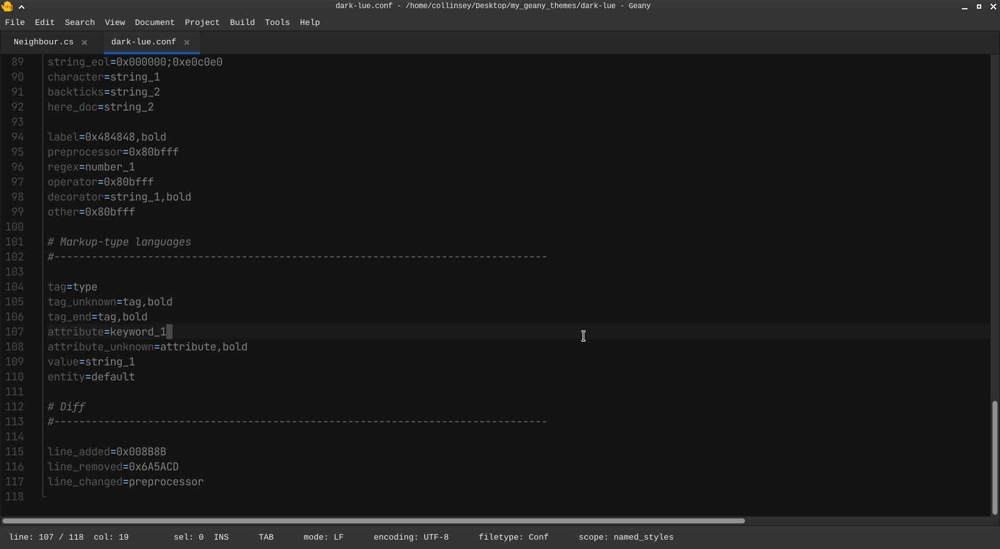
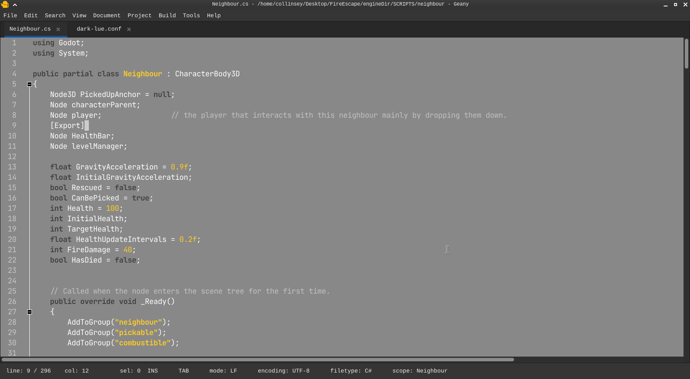
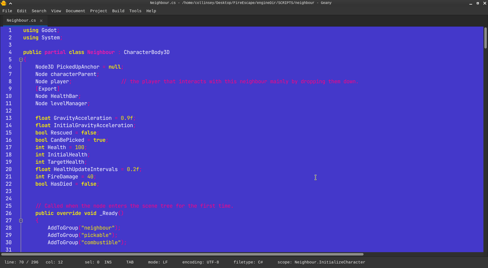

<h1>My Geany Theme Collection</h1>

<h2>How to install</h2>
Before downloading , check if the version written in the readme of the theme directory matches the version of the geany ide that you want to install the theme.
Failure to check versions or install theme that is incompatible with your geany version will break and not work.
Pick the theme directory you want.
Simply download the theme .conf file and place it in the geany colorschemes directory.

